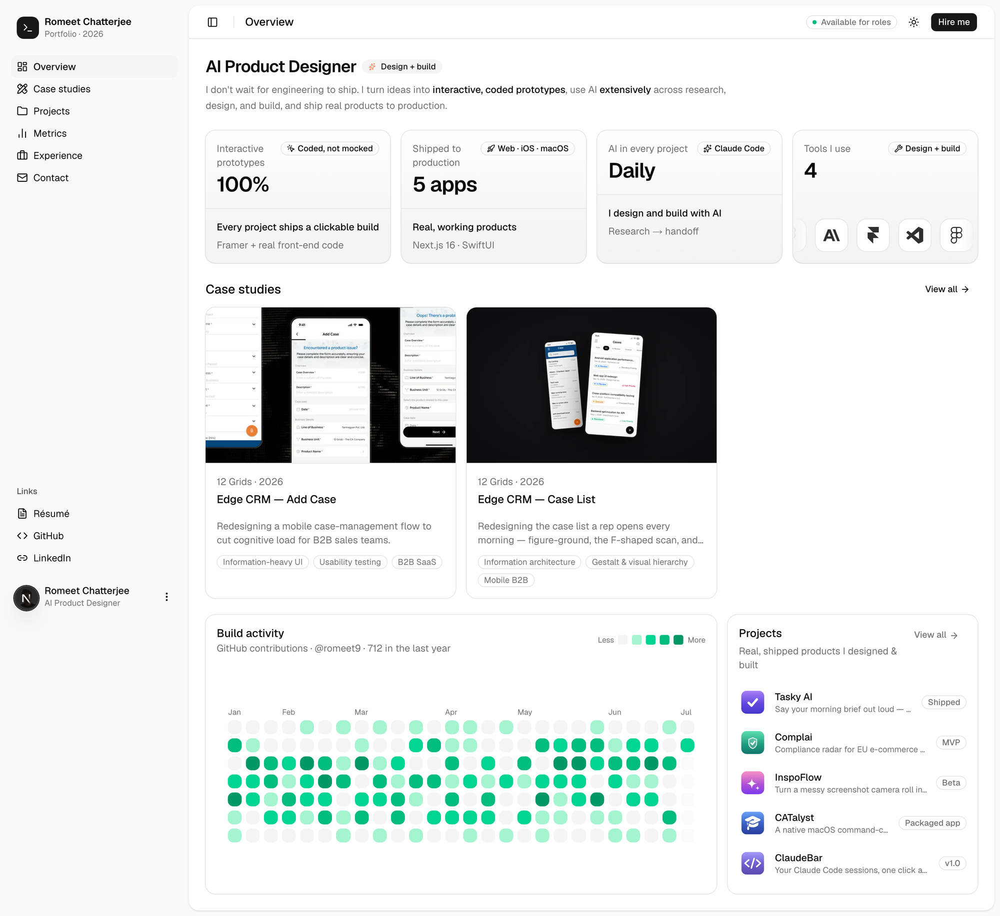

# Romeet Chatterjee — Portfolio Dashboard

Product designer's portfolio, presented as a product dashboard. Projects, metrics,
case studies and experience across web, iOS and macOS — every project ships an
interactive, coded build, not a mockup.

**Live:** [romeet.vercel.app](https://romeet.vercel.app)



## What's inside

- **Overview** — headline stats and a live GitHub build-activity heatmap
- **Case studies** — long-form UX write-ups (Edge CRM add-case + case-list flows)
- **Projects** — shipped products: Tasky AI, Complai, InspoFlow, CATalyst, ClaudeBar
- **Metrics** — outcome charts built with Recharts
- **Experience** — work history
- **Contact** — resume download + links

## Tech stack

- [Next.js 16](https://nextjs.org) (App Router, mostly static/SSG)
- [React 19](https://react.dev) + TypeScript
- [Tailwind CSS 4](https://tailwindcss.com) with shadcn/ui components
- [Motion](https://motion.dev) for animation
- [Recharts](https://recharts.org) for metrics
- Deployed on [Vercel](https://vercel.com)

## Getting started

```bash
npm install
npm run dev
```

Open [http://localhost:3000](http://localhost:3000).

## Scripts

| Command | Description |
| --- | --- |
| `npm run dev` | Start the dev server |
| `npm run build` | Production build |
| `npm run start` | Serve the production build |
| `npm run lint` | Run ESLint |

## Project structure

```
app/         Routes (overview, case-studies, projects, metrics, experience, contact)
components/  UI components (sidebar, header, cards, charts)
content/     Typed content sources (projects, case studies, metrics, experience)
public/      Static assets (mockups, illustrations, resume)
```

Content lives in typed `.ts` files under `content/` — edit those to update projects,
case studies, metrics and experience.

## License

Personal portfolio. Code is available for reference; content and assets are
© Romeet Chatterjee.
