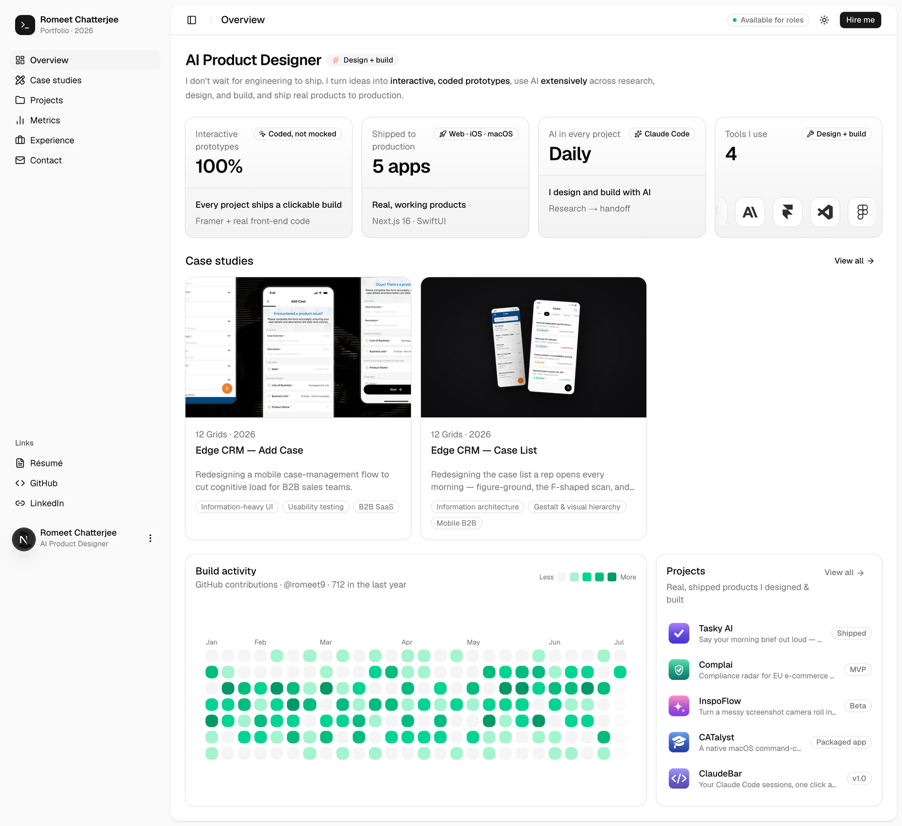
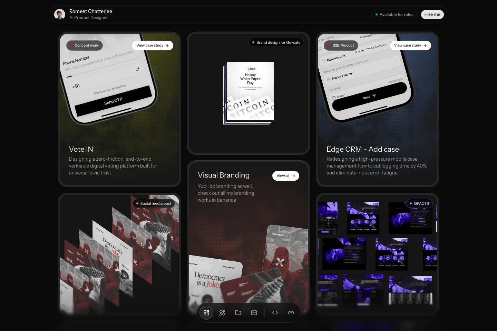
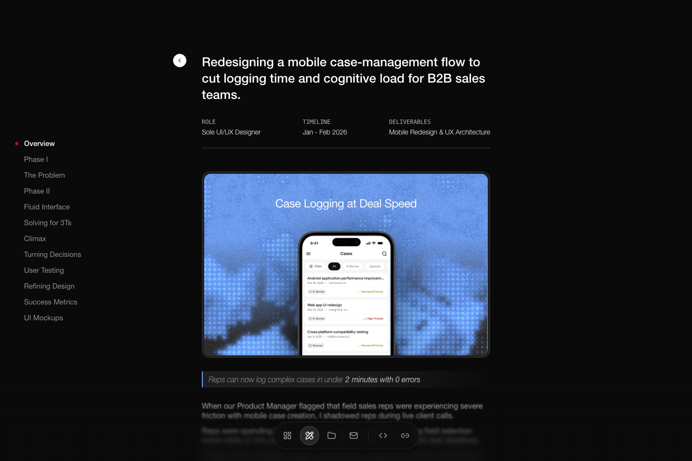
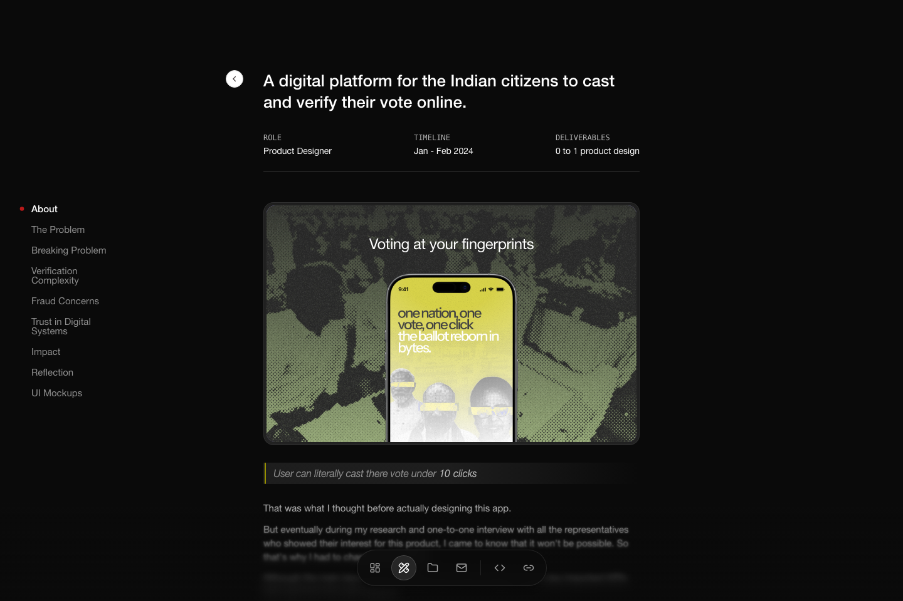
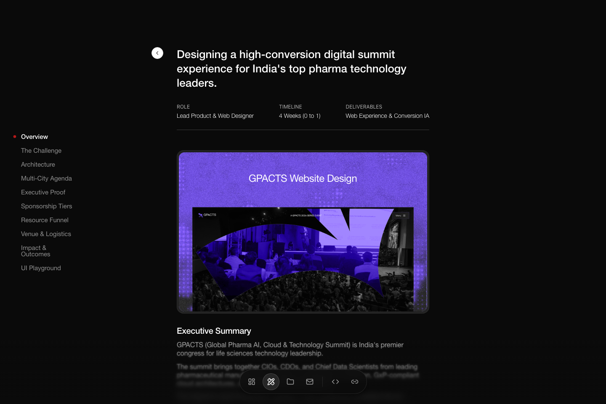
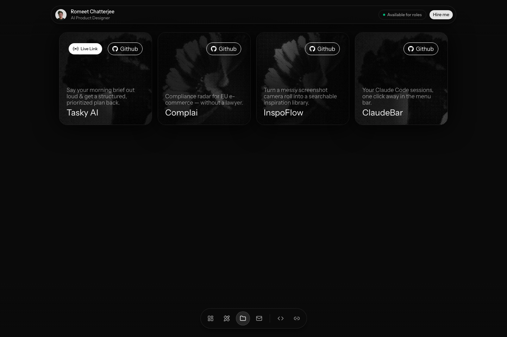

<div align="center">

# Romeet Chatterjee — Product Designer & Design Technologist

### Interactive Product Dashboard & Design Portfolio

[](https://romeet-portfolio.vercel.app)
[](https://nextjs.org/)
[](https://react.dev/)
[](https://tailwindcss.com/)
[](https://www.typescriptlang.org/)

<br />

<p align="center">
  A high-performance product designer portfolio built from the ground up as a live, coded product dashboard — featuring interactive case studies, responsive bento video grids, motion design, and enterprise-grade design systems.
</p>

[**Explore Live Demo ↗**](https://romeet-portfolio.vercel.app) • [**Read Case Studies ↗**](https://romeet-portfolio.vercel.app/case-studies) • [**View Shipped Projects ↗**](https://romeet-portfolio.vercel.app/projects)

<br />



</div>

---

## 🌟 Highlights & Architecture

- ⚡ **Interactive Product Dashboard**: Designed with dark-mode aesthetic, refined typography (*Instrument Sans* & *M PLUS Code Latin*), and custom glassmorphism.
- 🍱 **Dynamic Bento Grid**: Proportional 3-column bento architecture with mathematically balanced column baselines, container queries (`@container`), and interactive video cards.
- 🎥 **Embedded Video Showcases**: Video cards featuring autoloop preview states, project tags, and custom video management tools.
- 🎛️ **Dev Suite Toolbar**: Integrated developer tools with in-browser drag-and-drop card rearranging, custom layout persistence (`/api/save-layout`), and instant video replacer (`/api/upload-video`).
- 🏎️ **Optimized Performance**: Next.js 16 App Router with Turbopack, static site generation (SSG), responsive image/video delivery, and smooth inertia scrolling via Lenis.
- 🎨 **Coded Interactions**: Real-time canvas shaders, motion spring physics, custom fluid pointer effects, and Recharts KPI metrics.

---

## 📸 Visual Showcase & Key Pages

### 1. Overview Bento Grid
The central command center presenting featured case studies, live motion video cards, Behance deep dives, and shipped product summaries with equal baseline alignment.



---

### 2. Edge CRM — Enterprise Case Management Redesign
*Deep-dive UX case study exploring progressive disclosure, complex CRM workflows, add-case modals, and high-density tabular interfaces.*

- **Live URL**: [`/case-studies/edge-crm`](https://romeet-portfolio.vercel.app/case-studies/edge-crm)



---

### 3. Vote IN — Civic Participation Platform
*Designing a transparent voter pathway for state elections with candidate comparisons, polling station locators, and accessible civic information.*

- **Live URL**: [`/case-studies/vote-in`](https://romeet-portfolio.vercel.app/case-studies/vote-in)



---

### 4. GPACTS — Global Pulmonary Congress Platform
*Conversion-focused conference portal featuring interactive agendas, speaker directories, registration funnels, and responsive venue guides.*

- **Live URL**: [`/case-studies/gpacts`](https://romeet-portfolio.vercel.app/case-studies/gpacts)



---

### 5. Shipped Products & Prototypes
*Collection of coded, shipped software products and design experiments across web, iOS, and macOS.*

- **Live URL**: [`/projects`](https://romeet-portfolio.vercel.app/projects)



---

## 🛠️ Tech Stack

| Layer | Technologies |
| --- | --- |
| **Framework** | [Next.js 16](https://nextjs.org) (App Router, Turbopack, React 19 Server & Client Components) |
| **Styling** | [Tailwind CSS 4](https://tailwindcss.com), CSS Modules, CSS Container Queries |
| **Language** | [TypeScript 5](https://www.typescriptlang.org) (Strict type definitions) |
| **Motion & Animation** | [Motion](https://motion.dev) (Framer Motion), [Lenis](https://lenis.darkroom.engineering) (Smooth Scroll) |
| **UI Components** | Radix UI / Base UI, [shadcn/ui](https://ui.shadcn.com), [Lucide React](https://lucide.dev), [Sonner](https://sonner.emilkowal.ski) |
| **Data & Charts** | [Recharts](https://recharts.org) |
| **Hosting & Analytics** | [Vercel](https://vercel.com) & Vercel Web Analytics |

---

## 📁 Repository Structure

```text
romeet-portfolio/
├── app/                          # Next.js App Router
│   ├── api/
│   │   ├── save-layout/          # In-dev layout reordering persistence API
│   │   └── upload-video/         # In-dev video asset upload API
│   ├── case-studies/             # Case study showcase & [slug] dynamic pages
│   ├── contact/                  # Contact & resume download
│   ├── experience/               # Work history & career timeline
│   ├── projects/                 # Shipped applications & [slug] detail pages
│   ├── layout.tsx                # Root layout, fonts, SEO schema & providers
│   └── page.tsx                  # Dashboard homepage
├── components/                   # Reusable UI & Layout Components
│   ├── bento-video-card.tsx      # Video card with custom frame & badge
│   ├── case-study-card.tsx       # Case study preview cards
│   ├── custom-mouse-pointer.tsx  # Smooth custom interactive cursor
│   ├── floating-dock.tsx         # Bottom dock navigation
│   ├── layout-context.tsx        # Bento reordering drag-and-drop state provider
│   ├── overview-bento.tsx        # 3-column dynamic bento grid
│   ├── smooth-scroll.tsx         # Lenis smooth scroll provider
│   ├── video-context.tsx         # Video slot management context
│   └── video-upload-toolbar.tsx  # Dev Suite floating control toolbar
├── content/                      # Typed structured content sources
│   ├── bento-layout.json         # Persisted 3-column bento order
│   ├── case-studies.ts           # Case study metadata, mocks & copy
│   ├── projects.ts               # Shipped product details & screenshots
│   └── videos-config.json        # Video slot mappings & aspect configs
├── public/                       # Static assets, mockups, videos & screenshots
│   ├── screenshots/              # High-resolution README preview screenshots
│   └── videos/                   # Optimized MP4/WebM showcase video assets
```

---

## 🚀 Getting Started

### Prerequisites
- Node.js 18.17+ or later
- npm, pnpm, or bun

### 1. Clone the repository
```bash
git clone https://github.com/romeet9/romeet-portfolio.git
cd romeet-portfolio
```

### 2. Install dependencies
```bash
npm install
```

### 3. Run development server
```bash
npm run dev
```

Open [http://localhost:3000](http://localhost:3000) in your browser.

### 4. Build for production
```bash
npm run build
npm run start
```

---

## 👨‍💻 Author

**Romeet Chatterjee**
- **Website**: [romeet-portfolio.vercel.app](https://romeet-portfolio.vercel.app)
- **LinkedIn**: [linkedin.com/in/romeet-in](https://linkedin.com/in/romeet-in)
- **Behance**: [behance.net/romeetchatterjee](https://www.behance.net/romeetchatterjee)
- **GitHub**: [@romeet9](https://github.com/romeet9)
- **Email**: [chatterjeeromeet9@gmail.com](mailto:chatterjeeromeet9@gmail.com)

---

## 📄 License

This repository and its codebase are open for reference. Design work, case studies, branding assets, and project materials are © [Romeet Chatterjee](https://romeet-portfolio.vercel.app).
